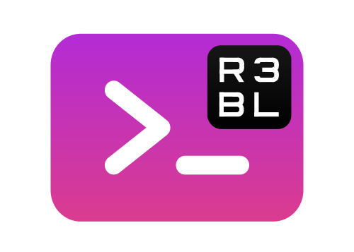

  

# Context

<code>R3BL
TUI
library
&amp;
suite
of
apps
focused
on
developer
productivity</code>

We are working on building command line apps in Rust which have rich text user interfaces (TUI). We
want to lean into the terminal as a place of productivity, and build all kinds of awesome apps for
it.

1. 🔮 Instead of just building one app, we are building a library to enable any kind of rich TUI
   development w/ a twist: taking concepts that work really well for the frontend mobile and web
   development world and re-imagining them for TUI & Rust.

   - Taking things like React, JSX, CSS, and Redux, but making everything async (they can be run in
     parallel & concurrent via Tokio).
   - Even the thread running the main event loop doesn't block since it is async.
   - Using proc macros to create DSLs to implement CSS & JSX.

2. 🌎 We are building apps to enhance developer productivity & workflows.

   - The idea here is not to rebuild tmux in Rust (separate processes mux'd onto a single terminal
     window). Rather it is to build a set of integrated "apps" (or "tasks") that run in the same
     process that renders to one terminal window.
   - Inside of this terminal window, we can implement things like "app" switching, routing, tiling
     layout, stacking layout, etc. so that we can manage a lot of TUI apps (which are tightly
     integrated) that are running in the same process, in the same window. So you can imagine that
     all these "app"s have shared application state (that is in a Redux store). Each "app" may also
     have its own Redux store.
   - Here are some examples of the types of "app"s we want to build:
     1. multi user text editors w/ syntax highlighting
     2. integrations w/ github issues
     3. integrations w/ calendar, email, contacts APIs

# About this binary crate: r3bl-cmdr

`r3bl-cmdr` is the second thing that's described above.

You can run it using `cargo run`.

This TUI (text user interface) app showcases the use of the `r3bl_rs_utils` crate. It contains quite
a few sample apps which are meant to be relevant use cases that are relevant for developer workflows
(who are remote, and work w/ teams).

# Contributing

This binary crate is being developed as a set of examples. The actual product will emerge as these
examples are evolved into features of the actual product, which is intended to be released to
developers.

Please read our [community contributing guidelines here](./CONTRIBUTING.md).
